🌎 Language

 
  
* en (Current)
* [pt-BR](./i18n/README-pt-BR.md)
---

## Stats

## My Projects

Repository                                             | Description                      | Deploy  
------------------------------------------------------ | -------------------------------- | ------------------------------------- 
[`/Projeto-Tal`](https://github.com/GTazz/Projeto-Tal) | Descrição do projeto e blablabla | [projeto-tal.gtazz.dev](https://projeto-tal.gtazz.dev)
[`/Projeto-Tal`](https://github.com/GTazz/Projeto-Tal) | Descrição do projeto e blablabla | [sub.gtazz.dev](https://sub.gtazz.dev)
[`/Projeto-Tal`](https://github.com/GTazz/Projeto-Tal) | Descrição do projeto e blablabla | N/A
[`/Projeto-Tal`](https://github.com/GTazz/Projeto-Tal) | Descrição do projeto e blablabla | N/A
[`/Projeto-Tal`](https://github.com/GTazz/Projeto-Tal) | Descrição do projeto e blablabla | [sub.gtazz.dev](https://sub.gtazz.dev)
[`/Projeto-Tal`](https://github.com/GTazz/Projeto-Tal) | Descrição do projeto e blablabla | [sub.gtazz.dev](https://sub.gtazz.dev)
