🌎 Language

 
  
* en (Current)
* [pt-BR](./i18n/README-pt-BR.md)
---

## Metrics

<picture>
  <source media="(min-width: 680px)" srcset="metrics.base.svg" width=49% alt="GitHub base stats" type="image/svg+xml">
  
</picture>

<picture>
  <source media="(min-width: 680px)" srcset="metrics.languages.svg" width=49% alt="GitHub languages stats" type="image/svg+xml">
  
</picture>

## My Projects

<a href="https://github.com/GTazz?tab=repositories&q=&type=&language=&sort=">
  <picture>
    <source media="(min-width: 680px)" srcset="metrics.projects.svg" width=49% alt="GitHub repos" type="image/svg+xml">
    
  </picture>
</a>
